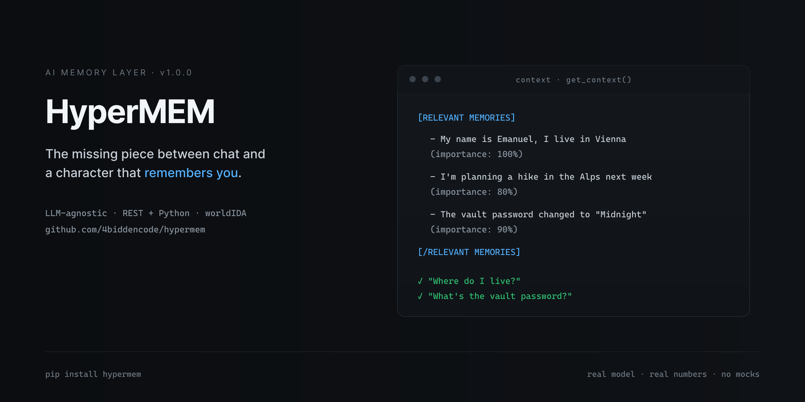
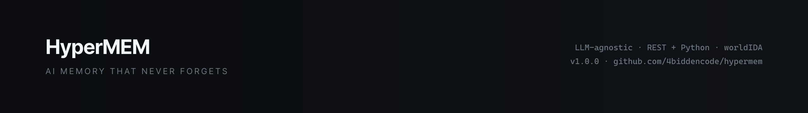

# HyperMEM - AI Memory That Never Forgets

[](https://github.com/4biddencode/hypermem/actions/workflows/ci.yml)
[](https://pypi.org/project/hypermem/)

<p align="center">
  
</p>

HyperMEM is a **memory layer** for AI applications — the missing piece
between "chat" and "a character that remembers you." It watches a
conversation, decides what is worth remembering, stores it verbatim, and
later injects the *relevant* memories back into the context window — so an
AI companion can recall a fact told **10,000 messages ago** as reliably as
one from yesterday, without a growing context and without remembering the
wrong things.

It is LLM-agnostic (Ollama, OpenAI, Anthropic, or any OpenAI-compatible
endpoint) and ships with a Python engine, a REST server, live world-state
tracking (`worldIDA`), and JSON persistence.

It is also **register-agnostic**: the judge classifies, the store is
verbatim, and worldIDA tracks relationship state — none of it filters or
reshapes content, so it serves **every roleplay type identically**: SFW,
suggestive, explicit. A companion app never has to run two memory stacks.

```
pip install hypermem
```

## Why it's different

Naive "memory" systems leak the two ways that actually break a companion:
they **store summaries instead of the real words** (so exact recall fails
after a rephrase), and they **never forget** (so a changed fact keeps
fighting the new one). HyperMEM's pipeline is built to do the honest job:

| Naive memory | HyperMEM |
|---|---|
| Judge *rewrites* the fact as a summary | Judge **classifies**; your words are stored **verbatim** (capped at 1000 chars) |
| Changed facts pile up and both get recalled | Type-aware **supersession**: the new fact wins, the old one is excluded |
| Episodic events accumulate forever | MemGPT-style **consolidation** folds them into durable knowledge |
| Recall re-ranks the whole list with an LLM | **Semantic (embedding) + lexical + importance + recency** hybrid, budgeted for the context window |
| Every recall costs an LLM call | Embedding-first recall skips the LLM call — **~10-50 ms** per recall |
| You can't tell why a memory surfaced | **Provenance**: the live score breakdown for any memory, for any query |
| Works with one model | Judge JSON parsing hardened so **gemma3:12b scores the same as qwen** |

## Install

Requires Python 3.10+.

```bash
pip install -e .            # core (any LLM via Ollama/OpenAI/Anthropic)
pip install -e ".[server]"  # + REST server (fastapi, uvicorn)
pip install -e ".[test]"    # + test tooling
```

## Quick Start

```python
import asyncio
from hypermem import HyperMEM

hm = HyperMEM()  # defaults: Ollama, qwen2.5:7b on localhost:11434

async def main():
    # HyperMEM auto-tags important details as they arrive, stored verbatim
    await hm.add_message("user", "My name is Emanuel, I live in Vienna")
    await hm.add_message("user", "I'm planning a hike in the Alps next week")

    # Later, the relevant memories come back — even with different wording
    ctx = await hm.get_context("Where do I live?")
    print(ctx)

    # Why did that surface? Live score breakdown, no magic.
    await hm.explain_recall("Where do I live?", hm.memories()[0]["id"])

asyncio.run(main())
```

Output:

```
[RELEVANT MEMORIES]
- My name is Emanuel, I live in Vienna (importance: 100%)
[/RELEVANT MEMORIES]
```

Put `ctx` into your system prompt and your AI now answers with facts it was
never given in the visible chat history.

## Try the demo

A self-contained story — 8 facts planted, **600 filler messages** simulating
weeks of chit-chat, a fact that *changes* mid-way, and the model answering
from injected memory. Run it against your local Ollama:

```bash
python examples/demo.py
python examples/demo.py --filler 1000 --model gemma3:12b
```

## REST Server

Expose the same engine over HTTP:

```bash
hypermem-server --port 8080 --llm-model qwen2.5:7b --llm-endpoint http://localhost:11434
```

```bash
curl -X POST localhost:8080/sessions -d '{"session_id": "rp1"}'
curl -X POST localhost:8080/sessions/rp1/messages \
  -d '{"role": "user", "content": "My name is Emanuel"}' -H "Content-Type: application/json"
curl "localhost:8080/sessions/rp1/context?message=What+is+my+name?"   # memories + chat + world state
curl "localhost:8080/sessions/rp1/memories/<id>?query=What+is+my+name?"  # provenance
```

Endpoints: `GET /health`, `POST/GET/DELETE /sessions` (and `/sessions/{id}`),
`POST /sessions/{id}/messages`, `POST /sessions/{id}/remember`,
`GET /sessions/{id}/recall?query=`, `GET /sessions/{id}/context`,
`GET /sessions/{id}/memories`, `GET /sessions/{id}/memories/{memory_id}`,
`PUT /sessions/{id}/persona`, `GET /sessions/{id}/world-ida`,
`POST /sessions/{id}/world-ida/update`, `GET /sessions/{id}/state`.

Sessions are auto-persisted to `--data-dir` (default `.hypermem_data/`) after
every change and survive restarts. Concurrent writes are serialized per-session
(no lost updates). API responses never leak raw embedding vectors.

## worldIDA — live world state

For roleplay and virtual-agent use, HyperMEM maintains **one compact state
object per session** (scene, character mood, relationship, ongoing action).
Unlike long-term memory it is never searched — it is fully rewritten every
turn and injected in full, so the model always knows *where it is right now*
without a growing context.

```python
await hm.update_world_ida(user_msg, ai_msg)
ctx = await hm.get_context("...")  # now includes [WORLD STATE]
```

Updates are **partial-output**: the model returns only the fields that
changed (fewer tokens, lower latency) and HyperMEM merges them over the
previous state. When a scene transitions (location/time shift), the old scene
is summarized into long-term memory automatically.

## How It Works

### 1 · Judge — *decide what matters, don't rewrite it*

Every `add_message` runs the fact-checker: an LLM classifies the message
(JSON, robustly extracted) as

```json
{"has_fact": true, "importance": 0.8,
 "memory_type": "static", "subject": "vault password",
 "keywords": ["password", "vault"]}
```

It never writes the memory text — the **user's message is stored verbatim**
(capped at `max_memory_chars`), so the exact tokens survive for recall. Cheap
filler ("Ok.", "I see.") is gated out before any LLM call. First-person
identity statements ("My name is…") get a deterministic `name` tag. A
near-duplicate fact (same meaning, reworded) refreshes the existing memory
instead of storing a copy.

### 2 · Lifecycle — *remember, supersede, consolidate, forget*

- **Supersession.** A newer *static/temporal* fact about the same subject
  **supersedes** the old one — strongly when a correction cue is present
  ("actually", "changed", "instead"). Episodic events coexist. Superseded
  memories are excluded from recall (the *stale-leak* fix).
- **Consolidation.** When a subject accumulates enough episodic events
  (default ≥6), the oldest are fused into one durable knowledge memory and
  archived — MemGPT-style, throttled to run at most once per
  `consolidation_interval` messages.
- **Decay.** Oversized history is archived by decay-adjusted importance.
  Archived memories are out of recall unless `search_archive` is enabled.

### 3 · Recall — *semantic-first, hybrid, budgeted*

Optional **embeddings** (auto-detected: Ollama `nomic-embed-text`, OpenAI
`text-embedding-3-small`; `"none"` to disable) power a **hybrid score**:

```
score = 2.0·cosine + 1.2·lexical + 0.5·importance + 0.3·recency
        + identity_boost (name queries)
```

A relative relevance floor drops off-topic noise; a token budget
(`max_recall_tokens`) caps the injected block. With embeddings on, recall
**skips the per-recall LLM call** (`recall_use_llm=False`) — tens of
milliseconds, not hundreds. Without embeddings, the LLM + lexical path
still works (and still beats the 0.x numbers).

### 4 · Inject

Recalled memories + recent chat + worldIDA are assembled into the context
prompt (`get_context`).

## Configuration

```python
from hypermem import HyperMEM, HyperMemConfig

config = HyperMemConfig(
    llm_provider="ollama",          # "ollama" | "openai" | "anthropic"
    llm_model="qwen2.5:7b",
    llm_endpoint="http://localhost:11434",
    llm_api_key=None,               # required for openai/anthropic
    embedding_provider="auto",      # "auto" | "ollama" | "openai" | "none"
    recall_use_llm=False,           # also run the LLM rank on top of embeddings
    max_recall_tokens=300,          # context-window budget for recalled memories
    auto_tag_threshold=0.4,         # minimum importance to store a fact
    max_active_memories=100,        # active mems before decay-archiving
    consolidation_threshold=6,      # episodic mems per subject before consolidation (0=off)
    consolidation_interval=20,      # min messages between consolidation runs
    auto_tagging=True,              # set False to only store explicit remembers
)
hm = HyperMEM(config)
```

## API

| Method | Description |
|--------|-------------|
| `await add_message(role, content)` | Add a message → judge, store verbatim, supersede, recall |
| `await remember(content, memory_type)` | Explicitly store a memory (pinned) |
| `await recall(query)` | Ranked memories relevant to a query (hybrid scoring, token-budgeted) |
| `await get_context(message)` | Build prompt with world state + memories + chat |
| `await explain_recall(query, memory_id)` | Provenance: the live score breakdown for one memory |
| `await update_world_ida(user, ai)` | Update the live world state object (partial-output) |
| `set_persona(Persona)` | Define persona — protected from memory operations |
| `to_dict() / from_dict()` | Serialize / restore the full engine |
| `save(path) / load(path)` | Atomic JSON persistence (includes world state) |
| `memories()` | List all memories with effective importance |

The engine is an async context manager: `async with HyperMEM() as hm:` closes
the HTTP client on exit.

## Persona Isolation

`set_persona()` defines the character/assistant identity. Persona fields are
excluded from memory extraction prompts and worldIDA rules forbid modifying
persona-level traits — the system remembers what is *said to it*, never
mistakes its own identity for conversation facts.

## Benchmarks

HyperMEM is benchmarked against a **real model** — no mock modes.
`full_suite.py` is the official harness: capability suites, repeated across
seeds (mean ± std) and models, with a markdown leaderboard report.

```bash
# Official harness
python benchmarks/full_suite.py --quick                      # smoke, ~15 min
python benchmarks/full_suite.py --full                       # everything, hours
python benchmarks/full_suite.py --models qwen2.5:7b,gemma3:12b --seeds 3
python benchmarks/full_suite.py --suites recall,answer --scales 100,1000,5000

# Mode comparison (normal vs hypermem vs hypermem+worldIDA)
python benchmarks/compare_modes.py --quick

# Per-plant-fact recall diagnostics
python benchmarks/diag_recall.py
```

### Results — v1.0.0, real Ollama, scales [100, 1000]

> Latest run: `qwen2.5:7b` + `gemma3:12b` · see `benchmarks/benchmark_report_full.md`

| suite · metric | qwen2.5:7b | gemma3:12b |
|---|---|---|
| recall · pass@1 @100 | **1.0** | **1.0** |
| recall · pass@1 @1000 | **1.0** | **1.0** |
| distractor · accuracy @100 | **1.0** | **1.0** |
| distractor · leaks @100 | **0.0** | **0.0** |
| contradiction · new fact wins @100 | **1.0** | **1.0** |
| contradiction · stale leak @100 | **0.0** | **0.0** |
| paraphrase · recall @100 | **0.917** | **0.958** |
| answer · hypermem @100 | **0.917** | **0.75** |
| answer · hypermem+worldIDA @100 | **0.917** | **0.75** |
| recall · latency @100 | **~137 ms** | ~833 ms |

For the 0.1.0 baseline this was: gemma **0.0 everywhere** (judge JSON never
parsed), qwen contradiction leak **1.0**, recall ≈ **0.57**, paraphrase ≈
**0.55**. The rework is the difference between "demo-only" and "load-bearing."

Suites: recall vs. distance, end-to-end answer accuracy across injection
modes (none / hypermem / +worldIDA), distractor resistance, contradiction
supersession, paraphrase robustness, p50/p95 latency, storage growth, and
worldIDA drift. Results land in `benchmarks/benchmark_results_full.json` +
`benchmark_report_full.md`.

## Repo Layout

```
hypermem/            Python package (engine, LLM client, embeddings, worldIDA, server)
tests/               hermetic test suite (stubbed Ollama API — runs in CI)
benchmarks/          real-model benchmark suite
examples/demo.py     self-contained end-to-end demo (public API only)
```

## License

Source-available — free for personal use and commercial projects under
10K ARR / 1K MAU; commercial license required above that. Attribution
required when you use it. See [LICENSE](LICENSE) and contact
hypermem@x5i.ch.

<p align="center">
  
</p>
