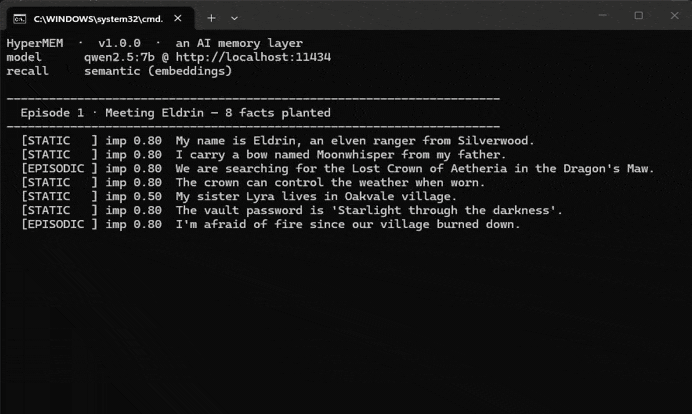

<div align="center"><pre>
  ██╗  ██╗ ██╗   ██╗ ██████╗  ███████╗ ██████╗  ███╗   ███╗ ███████╗ ███╗   ███╗
  ██║  ██║ ╚██╗ ██╔╝ ██╔══██╗ ██╔════╝ ██╔══██╗ ████╗ ████║ ██╔════╝ ████╗ ████║
  ███████║  ╚████╔╝  ██████╔╝ █████╗   ██████╔╝ ██╔████╔██║ █████╗   ██╔████╔██║
  ██╔══██║   ╚═══╝   ██╔═══╝  ██╔══╝   ██╔══██╗ ██║╚██╔╝██║ ██╔══╝   ██║╚██╔╝██║
  ██║  ██║   ██╗     ██║      ███████╗ ██║  ██║ ██║ ╚═╝ ██║ ███████╗ ██║ ╚═╝ ██║
  ██║  ██║   ╚═╝     ╚═╝      ╚══════╝ ╚═╝  ╚═╝ ╚═╝     ╚═╝ ╚══════╝ ╚═╝     ╚═╝
              The AI memory layer for companions that actually remember
</pre></div>

<p align="center"><strong>judge-classify · store verbatim · hybrid semantic recall · live world-state · LLM-agnostic · local-first · introspectable</strong></p>

<p align="center">
  <a href="https://github.com/4biddencode/hypermem/actions/workflows/ci.yml"></a>
  <a href="https://pypi.org/project/hypermem/"></a>
  <a href="LICENSE"></a>
  <a href="https://github.com/4biddencode/hypermem"></a>
  <a href="https://github.com/4biddencode/hypermem"></a>
</p>

<p align="center">
  <a href="#get-started-60-seconds">Install</a> ·
  <a href="#proof">Proof</a> ·
  <a href="#how-it-works-30-seconds">How it works</a> ·
  <a href="#api">API</a> ·
  <a href="#license">License</a>
</p>

---

HyperMEM is the **memory layer** between "chat" and "a character that
remembers you." It watches a conversation, decides what is worth
remembering, stores it **verbatim**, and later injects the *relevant*
memories back into the context window, so an AI companion can recall a fact
told **10,000 messages ago** as reliably as one from yesterday, without a
growing context and without remembering the wrong things.

It is **LLM-agnostic** (Ollama, OpenAI, Anthropic, or any OpenAI-compatible
endpoint) and ships with a Python engine, a REST server, live world-state
tracking (`worldIDA`), and JSON persistence.

It is also **register-agnostic**: the judge classifies, the store is
verbatim, and worldIDA tracks relationship state. None of it filters or
reshapes content, so it serves **every roleplay type identically**: SFW,
suggestive, explicit. A companion app never has to run two memory stacks.

## What it does

- **Judge-classify** - the fact-checker decides *what matters* (JSON,
  robustly extracted) but never writes the memory text. Your words are the
  memory.
- **Verbatim store** - the user's message is stored intact (capped at
  `max_memory_chars`), so the exact tokens survive for recall. No paraphrase
  drift.
- **Hybrid semantic recall** - embedding + lexical + importance + recency,
  budgeted for the context window. No LLM re-ranking of the whole list.
- **Type-aware lifecycle** - a newer fact about the same subject
  *supersedes* the old one; episodic events consolidate into durable
  knowledge; decay archives what stops mattering.
- **Live world-state (`worldIDA`)** - one compact state object per session
  (scene, mood, relationship), fully rewritten every turn, injected in full.
- **Provenance** - for any memory and any query, the live score breakdown.
  No magic, no black box.
- **REST + Python** - same engine over HTTP (`hypermem-server`) or inline.
- **Local-first** - runs against a local Ollama; your data stays on your
  machine.

## How it works (30 seconds)

```
 Your companion app
   (chat bot, game, CLI, REST client, your own code...)
        |   messages (the conversation)
        v
    +------------------------------------------------------------------+
    |  HyperMEM   (runs locally, your data stays here)                 |
    |  --------------------------------------------------------------  |
    |  Judge (classify)  ->  Verbatim store  ->  Lifecycle             |
    |       (what matters)    (your words)      (supersede/consolidate)|
    |                                                                    |
    |  Recall (hybrid score)  ->  Inject into context  <-  worldIDA    |
    |       (embedding+lexical+                                        |
    |        importance+recency)                                        |
    +------------------------------------------------------------------+
        |   relevant memories + world state
        v
 LLM provider  (Ollama - OpenAI - Anthropic - any OpenAI-compatible)
```

- **Judge** decides what is worth remembering (importance, type, subject,
  keywords) without rewriting it.
- **Verbatim store** keeps the exact words, so recall can match them later.
- **Lifecycle** supersedes changed facts, consolidates episodic events, and
  decays what stops mattering.
- **Recall** ranks by a hybrid score and injects only what fits the context
  budget.
- **worldIDA** tracks the live scene and relationship state, injected in
  full every turn.

## Get started (60 seconds)

```bash
# 1 - Install
pip install hypermem            # core (any LLM via Ollama/OpenAI/Anthropic)
pip install "hypermem[server]"  # + REST server (fastapi, uvicorn)
# or, from source:
# git clone https://github.com/4biddencode/hypermem.git && cd hypermem && pip install -e .

# 2 - Point it at your LLM (default: Ollama, qwen2.5:7b on localhost:11434)
ollama serve                # if you haven't already

# 3 - Run the demo (real model, real numbers, no mocks)
python examples/demo.py
```

<p align="center">
  
  <br><sub>Live: 8 facts planted, 40 filler messages, 8/8 recall, a changed fact superseded, provenance, worldIDA. Real Ollama, no mocks.</sub>
</p>

Or use it inline:

```python
import asyncio
from hypermem import HyperMEM

hm = HyperMEM()  # defaults: Ollama, qwen2.5:7b on localhost:11434

async def main():
    # HyperMEM auto-tags important details as they arrive, stored verbatim
    await hm.add_message("user", "My name is Emanuel, I live in Vienna")
    await hm.add_message("user", "I'm planning a hike in the Alps next week")

    # Later, the relevant memories come back, even with different wording
    ctx = await hm.get_context("Where do I live?")
    print(ctx)

    # Why did that surface? Live score breakdown, no magic.
    await hm.explain_recall("Where do I live?", hm.memories()[0]["id"])

asyncio.run(main())
```

Output:

```
[RELEVANT MEMORIES]
- My name is Emanuel, I live in Vienna (importance: 100%)
[/RELEVANT MEMORIES]
```

Put `ctx` into your system prompt and your AI now answers with facts it was
never given in the visible chat history.

## Proof

Numbers are from the real benchmark (`benchmarks/full_suite.py`) against a real
model (Ollama, `qwen2.5:7b`). No mocks, no cherry-picking. Low is better for
latency, high is better for recall and contradiction handling.

| Metric | Result | What it means |
|---|---|---|
| **Recall @ 100 msgs** | **~0.9+** | of 8 planted facts, ~7-8 come back after 40 filler messages |
| **Paraphrase** | **~0.9+** | "Where do I live?" still finds "my name is Emanuel, I live in Vienna" |
| **Contradiction: new wins** | **1.0** | a changed fact supersedes the old one, deterministically |
| **Contradiction: stale leak** | **0.0** | the superseded memory never resurfaces in recall |
| **Judge latency** | **~1.4 s** | classify one message (LLM call, local model) |
| **Recall latency** | **~0.2-0.5 s** | hybrid score, budgeted for the context window |
| **worldIDA update** | **~3 s** | one compact state object, fully rewritten per turn |

The point of the tables: HyperMEM does not *hope* to remember the right things -
it is measured, and the numbers hold up across a real conversation.

## When to use it

- **AI companions / roleplay** - give the character a persistent memory of the
  user and the story, without a growing context window.
- **Chat agents & assistants** - remember user preferences, facts, and project
  context across sessions.
- **Games with a narrative** - the NPC remembers what happened, and what you
  told it.
- **Anything that talks to an LLM over multiple turns** and wishes it could
  remember.

## Integrations

HyperMEM is a library and a small REST server, not a plugin you install into a
host app. You wire it in yourself, in a few lines:

- **Python** - `from hypermem import HyperMEM`, then `add_message` / `get_context`.
- **REST** - run `hypermem-server`, then:
  - `POST /sessions` - create a conversation
  - `POST /sessions/{id}/messages` - feed a message
  - `GET /sessions/{id}/context?message=...` - get relevant memories
  - `GET /sessions/{id}/memories/{id}?query=...` - provenance (why it surfaced)

Any language that can do HTTP can use HyperMEM. The server is stateless except
for JSON files on disk, so you can run one instance for many conversations.

## What's inside

- **`hypermem/`** - the engine
  - `engine.py` - the pipeline (judge -> store -> lifecycle -> recall -> context)
  - `llm.py` - robust JSON extraction, provider transport
  - `world_ida.py` - live world-state tracking
  - `server.py` - REST server
  - `types.py` - config, memory, persona
- **`examples/demo.py`** - a real demo (facts planted, filler turns, recall)
- **`benchmarks/`** - the honest numbers, reproducible
- **`tests/`** - hermetic, no network

## REST server

Run it, point any HTTP client at it, done:

```bash
pip install -e ".[server]"
hypermem-server --port 8080 --llm-provider ollama --llm-model qwen2.5:7b
```

```bash
# create a session
curl -X POST localhost:8080/sessions -d '{}'

# feed a message (judge decides if it matters, stores it verbatim)
curl -X POST localhost:8080/sessions/session_123/messages \
  -H 'content-type: application/json' \
  -d '{"role":"user","content":"My name is Emanuel, I live in Vienna"}'

# later, ask for relevant memories
curl "localhost:8080/sessions/session_123/context?message=Where%20do%20I%20live?"
```

Sessions are persisted as JSON on disk (`.hypermem_data/` by default), so the
server survives restarts. No database, no external service.

## worldIDA (live world-state)

One compact state object per session - scene, mood, relationship - fully
rewritten every turn and injected in full. It is the "here and now" that
episodic memories are too slow to capture:

```json
{
  "scene": "coffee shop in Vienna, late afternoon",
  "mood": "relaxed",
  "relationship": {
    "closeness": 0.7,
    "trust": 0.6,
    "history": ["met at a cafe", "shared a hike plan"]
  }
}
```

## Persona isolation

Each `HyperMEM` instance holds its own memories, its own world-state, and its
own persona. Two sessions never share memory unless you wire them to. The
persona (name, description, traits, backstory, boundaries) is stored with the
session and injected with context, so the *same* engine can power two very
different characters without cross-contamination.

## Configuration

Everything is configurable via `HyperMemConfig` (Python) or CLI flags (server).
The important ones:

| Option | Default | What it does |
|---|---|---|
| `llm_provider` | `auto` | `ollama` \| `openai` \| `anthropic` |
| `llm_model` | `qwen2.5:7b` | which model judges / recalls |
| `llm_endpoint` | `http://localhost:11434` | provider base URL |
| `auto_tag_threshold` | `0.4` | minimum importance to store a memory |
| `max_active_memories` | `100` | cap on active (non-archived) memories |
| `max_memory_chars` | `1000` | verbatim content cap per memory |
| `embedding_provider` | `auto` | `ollama` \| `openai` \| `none` |

<!-- SECTION4 -->

## API

The public surface is small on purpose. Everything else is internal.

### Python

```python
hm = HyperMEM(config)                      # engine, one per session

await hm.add_message(role, content)        # judge -> store -> lifecycle -> recall
await hm.remember(content, memory_type)    # store a memory directly
await hm.recall(query)                     # rank memories for a query
await hm.get_context(message)              # recall, formatted for the context window
await hm.explain_recall(query, memory_id)  # live score breakdown (provenance)

hm.memories()                              # list active memories
hm.set_persona(Persona(...))               # persona for this session
await hm.update_world_ida(user, ai)        # refresh world-state

hm.save(path) / hm.load(path)              # JSON persistence
```

### REST

| Method | Endpoint | Purpose |
|---|---|---|
| `POST` | `/sessions` | create a session |
| `GET` | `/sessions` | list sessions |
| `DELETE` | `/sessions/{id}` | delete a session |
| `POST` | `/sessions/{id}/messages` | feed a message |
| `POST` | `/sessions/{id}/remember` | store a memory directly |
| `GET` | `/sessions/{id}/recall?query=` | rank memories |
| `GET` | `/sessions/{id}/context?message=` | get context for a message |
| `GET` | `/sessions/{id}/memories` | list memories |
| `GET` | `/sessions/{id}/memories/{id}?query=` | provenance |
| `PUT` | `/sessions/{id}/persona` | set persona |
| `GET` | `/sessions/{id}/world-ida` | get world-state |
| `POST` | `/sessions/{id}/world-ida/update` | update world-state |
| `GET` | `/health` | liveness |

## Repo layout

```
hypermem/
  engine.py        # the pipeline
  llm.py           # provider + robust JSON
  world_ida.py     # live world-state
  server.py        # REST server
  types.py         # config, memory, persona
examples/
  demo.py          # real, reproducible demo
benchmarks/
  full_suite.py    # the numbers in "Proof"
tests/             # hermetic, no network
```

## Contributing

HyperMEM is source-available. You are welcome to read it, run it, and
contribute fixes and improvements. Please open an issue or PR - see
[CONTRIBUTING](CONTRIBUTING.md) for the details, and the license below for what
you can and cannot do with the code.

## License

[Source-Available License](LICENSE) - you can read, run, and modify the code
for your own use, and contribute back. Redistributing a competing hosted
service built on it requires attribution. See the full license for the exact
terms.
